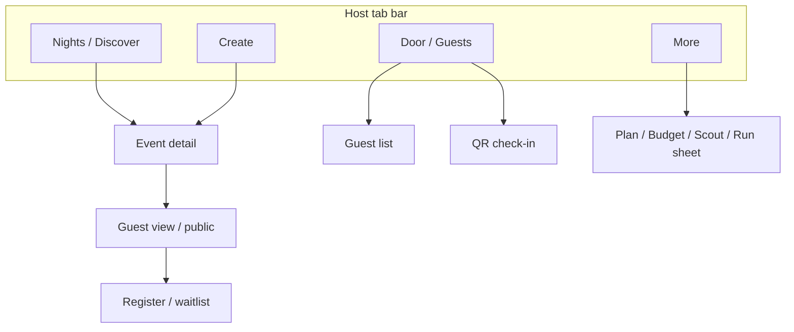

# HostKit information architecture

**Mobile-first.** HostKit ships as a phone app (Expo / React Native or mobile PWA). Canonical nav is a **bottom tab bar**. The Next.js demo in `/app` is a planning prototype.

Maps a Luma-style **create → public page → manage** loop onto HostKit’s existing host-side planner (venues, budget, timeline, run sheet). Guest accounts are still not required: public registration and check-in use HostKit tokens, same idea as `/rsvp/[token]`.



## Audiences

| Role | Sees | Never sees |
| --- | --- | --- |
| **Host** (signed-in planner) | Discover home, create, manage tabs, planner under More, check-in | Other hosts’ budgets |
| **Guest** (no account) | Public event page, register, ticket/QR, emails | Manage, budget, vendor shortlist |
| **Door staff** (host or delegated) | Check-in mobile, guest search, status | Full budget / vendor quotes |

Venue and vendor owners still never log in. The catalog remains seeded scouting data.

## Global chrome

### Host app — bottom tabs (canonical)

| Tab | Job |
| --- | --- |
| **Nights** | Discover / home: your events + nearby |
| **Create** | New event composer (clay circle) |
| **Door** | Guests list + QR check-in for the selected night |
| **More** | Plan, Budget, Scout, Shortlist, Run sheet, Account |

Event detail is a **stack screen** on Nights (not its own tab). Guest-facing register links hide the host tab bar.

Phone frame: 390 × 844. See `MOBILE.md`.

### Marketing / logged-out (PWA splash or first launch)

`HostKit` wordmark · **Plan an event** (clay pill) · Sign in as text.

### Tablet companion

Wide header + underline manage tabs (Overview | Guests | Registration | Blasts | Insights | More) — see `SCREENS.md` and `mockups/*.html` without the `mobile-` prefix. Do not treat that chrome as the phone UI.

## Screen map

### 1. Discover / home — `/`

Two modes, one URL:

| Signed out | Signed in |
| --- | --- |
| Editorial landing + public event cards (sample/demo) | **Your nights** (upcoming + drafts) + **Happening nearby** (public events) |

Primary CTA: **Create event** (signed in) or **Plan an event** (signed out → signup → create).

Secondary: search by city / date / tag. This is *event* discovery, distinct from HostKit’s venue **Scout** (`/events/[id]/discover`).

### 2. Create event — `/events/new`

Single scrolling composer with a sticky live preview. Order of sections (Luma-shaped fields, HostKit copy and extras):

1. Title  
2. Date, start/end time, timezone  
3. Format: In person / Online / Hybrid  
4. Cover image  
5. Location and/or meeting link  
6. Rich description  
7. **HostKit plan extras** (not in Luma): event type template, planned headcount, city, budget — these generate timeline + budget categories  
8. Theme picker (HostKit catalog, 40+; see `DESIGN_SYSTEM.md`)  
9. Calendar (which host calendar this event belongs to)  
10. Visibility: Public / Unlisted / Members of calendar  
11. Registration: approval, capacity, waitlist, plus-ones  

Actions: **Save draft** · **Publish**

### 3. Public event page — `/e/[slug]` (guest)

Cover · title · when/where · host · register card · description · calendar add · share. Theme tokens from the event apply here *and* in outbound email.

Existing HostKit RSVP tokens remain valid as an alternate entry (`/rsvp/[token]` for private invites).

### 4. Manage dashboard — `/events/[id]/…`

Primary tabs (always visible), mapped from the public Luma manage pattern, HostKit labels:

| Tab | Route | Job |
| --- | --- | --- |
| **Overview** | `/events/[id]` | Pulse: RSVPs, traffic, coverage, next actions |
| **Guests** | `/events/[id]/guests` | Status table, approve/decline, CSV, check-in |
| **Registration** | `/events/[id]/registration` | Tickets/tiers, questions, capacity, waitlist |
| **Blasts** | `/events/[id]/blasts` | Email composer to guest segments |
| **Insights** | `/events/[id]/insights` | Views, referrers, cities, UTM, attendance |
| **More** | dropdown | HostKit planner + settings |

**More** (HostKit-native; do not bury permanently):

- Plan (timeline)  
- Budget  
- Scout (venues & vendors)  
- Shortlist  
- Run sheet  
- Event settings (theme, visibility, calendar, danger zone)

This preserves today’s `EventNav` information without crowding the Luma-shaped primary tabs. **On phone, these become stack segments or More-sheet rows**, not a seven-item top bar.

```
Phone:  Nights | Create | Door | More
Tablet: Overview | Guests | Registration | Blasts | Insights | More ▾
```

### 5. Guests — `/events/[id]/guests`

Status chips (counts on each):

| Chip | Meaning in HostKit |
| --- | --- |
| Going | Registered / attending (incl. plus-ones in the count) |
| Pending | Approval queue |
| Waitlist | Over capacity, waiting |
| Invited | Host-added, no response (today’s `INVITED`) |
| Not going | Declined / cancelled |
| Checked in | Door scan recorded |

Toolbar: search (name, email, **domain**), sort, **Approve / Decline**, bulk CSV update, **QR check-in**, **Export CSV**.

Headcount rule from `lib/guests.ts` still applies: planning headcount starts from the host estimate and only moves on a real signal.

### 6. Registration — `/events/[id]/registration`

Ticket types (Free / Request to join / Paid placeholder), capacity, waitlist toggle, custom questions, approval policy. HostKit does not move money today — paid tickets are **visual only** until payments exist.

### 7. Blasts — `/events/[id]/blasts`

Segment (Going, Pending, Waitlist, Invited, Checked in, custom) → subject → body. Accent color from the event theme tints buttons in the email preview. Copy: HostKit still does not send mail in the demo; UI can **Copy blast** / **Download .eml** like current inquiry drafts.

### 8. Insights — `/events/[id]/insights`

Page views, live traffic, top referrers, cities, sources (UTM), referral hosts, attendance (registered vs checked in). Sample charts only in this pack.

### 9. Check-in mobile — `/events/[id]/check-in`

Narrow viewport. Camera/QR, search fallback, big Going / not-on-list states. Linked from Guests.

## Navigation rules

- **Tab bar is always the host’s compass.** Event switching happens on Nights; Door uses the last selected event.  
- **Preview** opens Guest view (theme applied). Hosts get a Manage control to return.  
- **Scout / Budget / Plan** are More-sheet rows and deep links from Event detail coverage.  
- Guest-facing surfaces never show host tabs.  
- Check-in is the Door tab’s Scan segment, bookmarkable as `/door?scan=1`.

## Mapping from today’s HostKit app

| Today | In this IA |
| --- | --- |
| `/` landing | Discover home (logged-out) |
| `/events` My events | Discover home (signed-in, “Your nights”) |
| `/events/new` six questions | Create composer (those six + publish fields) |
| `/events/[id]` overview | Manage Overview (plus traffic/registration pulse) |
| `/events/[id]/guests` | Guests tab (statuses expanded) |
| `/rsvp/[token]` | Still the private invite path; public register is additional |
| Plan, Budget, Discover, Shortlist, Run sheet | **More** + deep links from Overview |

## Object model (design-level)

```
Calendar (host workspace)
  └── Event
        ├── Theme + accent
        ├── Visibility + format + location
        ├── Registration policy + ticket types
        ├── Guests[] (status, plus-ones, check-in)
        ├── Blasts[]
        └── Plan (budget, tasks, inquiries)   ← existing HostKit
```

Calendars let a host keep “Personal”, “The Lantern Sessions”, etc. Visibility **Members of calendar** is calendar-scoped, not a Luma club clone — it is simply “people already on this calendar’s past guest lists.”
